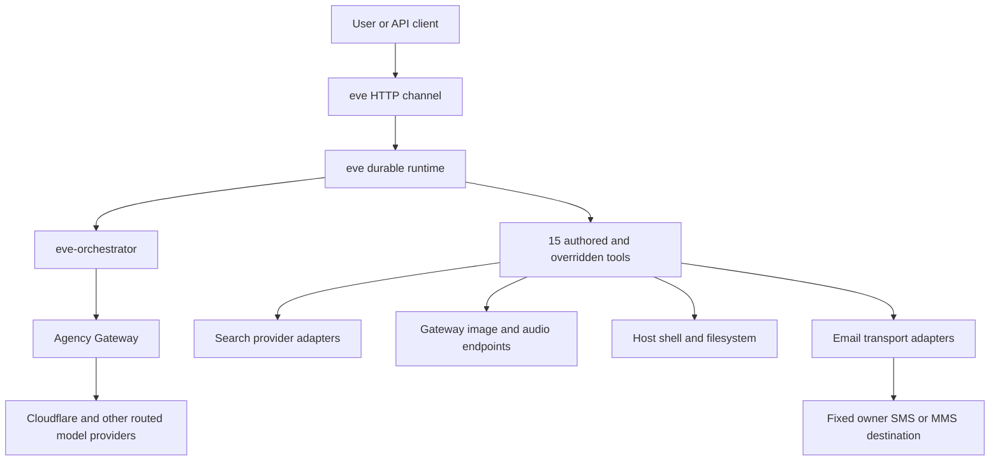

# Architecture

Eve is a filesystem-first agent built on `eve@0.37.0`. This repository owns the
agent definition and project-specific adapters. The sibling `eve-source-code`
repository owns the framework fork, and the sibling `agency` repository owns the
Agency Gateway.

## Runtime topology

## Repository ownership

| Repository        | Owns                                                                          |
| ----------------- | ----------------------------------------------------------------------------- |
| `eve`             | Agent configuration, instructions, channels, tools, adapters, project docs    |
| `eve-source-code` | Fork of `vercel/eve`, framework source, bundled docs, shared framework skills |
| `agency`          | Gateway aliases, routing, provider credentials, health probes, operations     |

The installed framework documentation under `node_modules/eve/docs/` matches the
runtime dependency. Use `eve-source-code` when developing or inspecting the fork,
not as a runtime dependency of this agent.

## Agent definition

- `agent/agent.ts` selects `gateway.chat("eve-orchestrator")`, declares the 256K
  context window, enables high reasoning, and sets session limits.
- `agent/instrumentation.ts` configures PostHog OpenTelemetry and Sentry.
- `agent/instructions.md` defines Eve's identity and standing behavior.
- `agent/channels/eve.ts` exposes the durable HTTP session API with the
  `vercelOidc()` then `localDev()` auth walk.

`pnpm run info` currently resolves one channel, 15 tools, and no declared
subagents, schedules, connections, or agent-packaged skills.

## Tool architecture

### Host tools

`bash`, `read_file`, `write_file`, `glob`, and `grep` override eve's sandbox-backed
defaults and execute against the local host. Shared implementation lives in
`agent/lib/host-tools.ts`.

### Search

Four model-facing tools remain distinct so Eve can choose a provider deliberately:

- `web_search` — Tavily
- `exa_search` — Exa
- `brave_search` — Brave
- `firecrawl_search` — Firecrawl

Provider HTTP details implement the shared contract under `agent/lib/search/`.
The common layer owns input/output shape, response validation, cancellation,
content bounds, and safe errors.

### Gateway media and operations

- `generate_image`
- `text_to_speech`
- `transcribe_audio`
- `check_proxy_health`
- `whoami`

Gateway configuration and auth headers are centralized in `agent/lib/gateway.ts`.
The gateway, rather than Eve, owns chat-model fallback order.

### Outbound messaging

`send_message` is a proactive tool, not an inbound channel. It can address only
the configured owner destinations. The internal seam separates:

- Verizon destination validation (`@vtext.com` and `@vzwpix.com`)
- SMTP, Resend, and AgentMail email transports
- attachment loading and operation identifiers

AgentMail accepted test messages but Verizon did not deliver them to the handset.
Provider acceptance is not delivery verification. A future Resend Chat SDK channel
would be a separate bidirectional surface with inbound webhooks and thread state.

## Durability and generated state

Eve persists sessions, turns, steps, streams, and waits under `.eve/`. A completed
step is replayed; an interrupted step can run again, so external side effects need
idempotency or approval. `.output/` contains the Nitro server build.

Both directories are generated and gitignored. Do not edit them by hand.

## Skills and source synchronization

Three project skill entries are tracked symlinks into `eve-source-code`:

- `eve`
- `technical-writing`
- `gh-pr-description`

`pnpm sync` refreshes the clean sibling checkout; the symlinks then expose the
updated framework-owned content automatically. Vercel plugin skills in
`.agents/skills/` are project-owned snapshots and do not update through that
chain.
