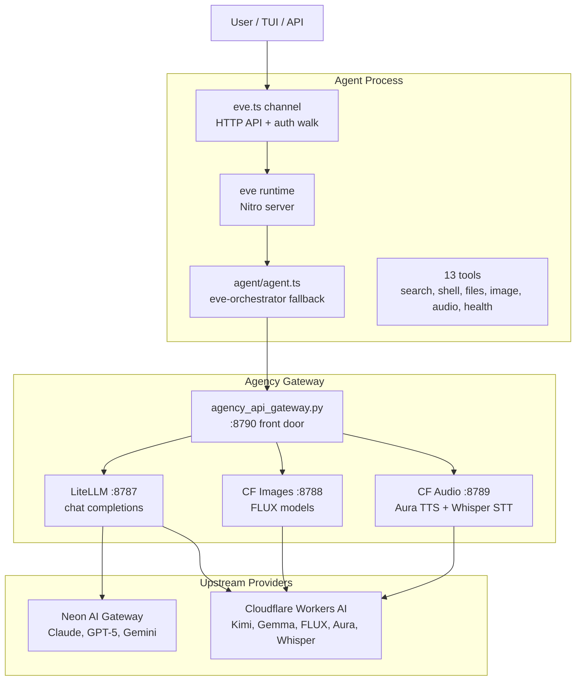

# Architecture

Eve is a filesystem-first AI agent built on the [vercel/eve](https://github.com/vercel/eve) framework (v0.37.0). The agent lives in `agent/` — everything is a file that eve compiles and runs.

## System overview



## Directory layout

```
eve/
├── agent/                  ← the agent definition (eve compiles this)
│   ├── agent.ts            ← model config, reasoning, limits
│   ├── instructions.md     ← always-on system prompt (identity + rules)
│   ├── channels/
│   │   └── eve.ts          ← HTTP channel with auth walk (vercelOidc + localDev)
│   ├── lib/
│   │   ├── gateway.ts             ← shared Agency Gateway provider
│   │   └── host-tools.ts          ← host-native shell/file helpers
│   └── tools/
│       ├── whoami.ts              ← returns the signed-in principal
│       ├── check_proxy_health.ts ← probes all three gateway lanes
│       ├── generate_image.ts      ← FLUX image generation via Workers AI
│       ├── text_to_speech.ts      ← Aura TTS via Workers AI
│       ├── transcribe_audio.ts    ← Whisper STT via Workers AI
│       ├── bash.ts                ← host-native shell override
│       ├── read_file.ts           ← host-native file read override
│       ├── write_file.ts          ← host-native file write override
│       ├── glob.ts                ← host-native glob override
│       ├── grep.ts                ← host-native grep override
│       ├── web_search.ts         ← Tavily web search
│       ├── exa_search.ts         ← Exa neural search
│       ├── brave_search.ts       ← Brave web search
│       └── firecrawl_search.ts   ← Firecrawl web search
│
├── docs/                  ← our own docs (not the upstream framework docs)
│   ├── architecture.md     ← this file
│   ├── config.md           ← env vars, model config, gateway settings
│   ├── ops.md              ← dev/build/deploy runbook
│   ├── security.md         ← auth, secrets, trust boundaries
│   ├── research/           ← research notes and explorations
│   └── roadmaps/           ← phased roadmap and planning
│
├── .agents/skills/        ← skills copied from eve source (reference)
├── .github/workflows/      ← CI: daily upstream sync
├── .gitignore              ← ignores .env, .eve/, .output/, node_modules/
├── .env                    ← gateway credentials (gitignored, never committed)
├── .env.example            ← template for .env
├── package.json            ← eve 0.37.0, ai 7, zod 4, @ai-sdk/openai
├── tsconfig.json           ← TypeScript config for agent/ and evals/
├── pnpm-lock.yaml          ← pinned dependency tree
├── pnpm-workspace.yaml     ← build-script approvals
├── eve.code-workspace      ← VS Code multi-root: eve + agency + eve-source-code
└── ROADMAP.md              ← high-level roadmap (mirrors docs/roadmaps/)
```

## The .eve directory

`.eve/` is **generated by eve** — it's the compiled output and runtime state. Gitignored. Contains:

| Path                   | What                                                 |
| ---------------------- | ---------------------------------------------------- |
| `.eve/compile/`        | Compiled agent manifest, module map, diagnostics     |
| `.eve/discovery/`      | Tool/skill/subagent discovery results                |
| `.eve/builds/`         | Nitro build artifacts (each build gets a unique dir) |
| `.eve/logs/`           | Dev session logs (JSONL)                             |
| `.eve/dev-runtime/`    | Runtime snapshot for dev mode                        |
| `.eve/.workflow-data/` | Durable session state (survives crashes)             |

Never edit `.eve/` by hand. Delete it to force a full recompile.

## How the agent works

1. **Author** — write files under `agent/` (instructions, tools, channels, connections)
2. **Compile** — `eve info` validates; `eve build` compiles to Nitro server
3. **Run** — `eve dev` (TUI) or `eve start` (HTTP server) — sessions are durable
4. **Sessions** — long-lived conversations that survive process restarts via `.eve/.workflow-data/`
5. **Compaction** — when context nears the window limit (256K for eve-orchestrator), eve summarizes older turns

## The model

- **Primary:** `eve-orchestrator` via Agency Gateway (LiteLLM fallback group)
- **Fallback order:** YRKA > JAMI; Kimi K2.7-code > Kimi K2.6 > Gemma 4
- **Provider:** `@ai-sdk/openai` with `.chat()` to force Chat Completions API
- **Why `.chat()`:** LiteLLM doesn't support OpenAI's Responses API; `.chat()` sends to `/v1/chat/completions`
- **Context window:** 256,000 tokens (set via `modelContextWindowTokens` for compaction)
- **Reasoning:** high effort
- **Switching models:** change the string in `gateway.chat("model-alias")` — all gateway aliases are available
