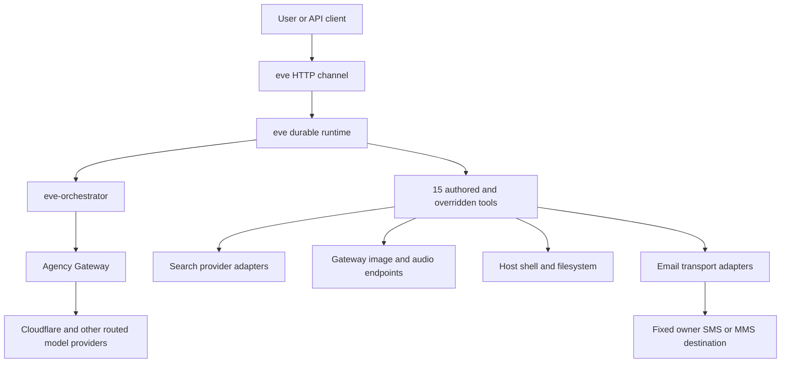

# Architecture

Luna is a filesystem-first agent built on `eve@0.38.3`. This repository owns the
agent definition and project-specific adapters. The sibling `eve-source-code`
repository owns the framework fork, and the sibling `agency` repository owns the
Agency Gateway.

## Runtime topology

## Repository ownership

| Repository        | Owns                                                                          |
| ----------------- | ----------------------------------------------------------------------------- |
| `luna`            | Agent configuration, instructions, channels, tools, adapters, project docs    |
| `eve-source-code` | Fork of `vercel/eve`, framework source, bundled docs, shared framework skills |
| `agency`          | Gateway aliases, routing, provider credentials, health probes, operations     |

The installed framework documentation under `node_modules/eve/docs/` matches the
runtime dependency. Use `eve-source-code` when developing or inspecting the fork,
not as a runtime dependency of this agent.

## Agent definition

- `agent/agent.ts` selects `gateway.chat("eve-orchestrator")`, declares the 256K
  context window, enables high reasoning, and sets session limits.
- `agent/instrumentation.ts` configures PostHog OpenTelemetry and Sentry.
- `agent/instructions.md` defines Luna's identity and standing behavior.
- `agent/channels/eve.ts` exposes the durable HTTP session API through Vercel
  OIDC, production HTTP Basic, and deliberately open local development auth.
- `agent/channels/resend.ts` maps owner email to durable sessions through the
  official Resend Chat SDK adapter and Neon-backed Chat SDK state.

`pnpm run info` resolves two channels, 15 tools, one schedule, and no declared
subagents, connections, or agent-packaged skills.

## Tool architecture

### Host tools

`bash`, `read_file`, `write_file`, `glob`, and `grep` execute directly against the
host during local development. The same authored tool names select eve's official
sandbox implementations on Vercel, where `defaultBackend()` selects Vercel
Sandbox. Shared local implementation lives in `agent/lib/host-tools.ts`.

### Search

Four model-facing tools remain distinct so Luna can choose a provider deliberately:

- `web_search` — Tavily
- `exa_search` — Exa
- `brave_search` — Brave
- `firecrawl_search` — Firecrawl

Provider HTTP details implement the shared contract under `agent/lib/search/`.
The common layer owns input/output shape, response validation, cancellation,
content bounds, and safe errors.

### Gateway media and operations

- `generate_image`
- `text_to_speech`
- `transcribe_audio`
- `check_proxy_health`
- `whoami`

Gateway configuration and auth headers are centralized in `agent/lib/gateway.ts`.
The gateway, rather than Luna, owns chat-model fallback order.

### Outbound messaging

`send_message` is a proactive tool, not an inbound channel. It can address only
the configured owner destinations. The internal seam separates:

- Verizon destination validation (`@vtext.com` and `@vzwpix.com`)
- SMTP, Resend, and AgentMail email transports
- attachment loading and operation identifiers

AgentMail accepted test messages but Verizon did not deliver them to the handset.
Provider acceptance is not delivery verification. The Resend channel is the
bidirectional communication surface; the older transport selector remains only
until live cutover tests decide whether any path still earns its keep.

## State ownership

- eve and Vercel Workflow own sessions, turns, steps, streams, waits, and replay.
- `defineState` owns conversation-scoped working state.
- Chat SDK's `chat_state_*` Neon tables own subscriptions, locks, deduplication,
  queues, and adapter cache.
- Future Luna-owned Neon tables will own independently queryable global and project
  memory. They must not reuse Chat SDK's tables.

## Durability and generated state

Luna persists sessions, turns, steps, streams, and waits under `.eve/`. A completed
step is replayed; an interrupted step can run again, so external side effects need
idempotency or approval. `.output/` contains the Nitro server build.

Both directories are generated and gitignored. Do not edit them by hand.

## Skills and source synchronization

Three project skill entries are tracked symlinks into `eve-source-code`:

- `eve`
- `technical-writing`
- `gh-pr-description`

`pnpm sync` refreshes the clean sibling checkout; the symlinks then expose the
updated framework-owned content automatically. Vercel plugin skills in
`.agents/skills/` are project-owned snapshots and do not update through that
chain.
