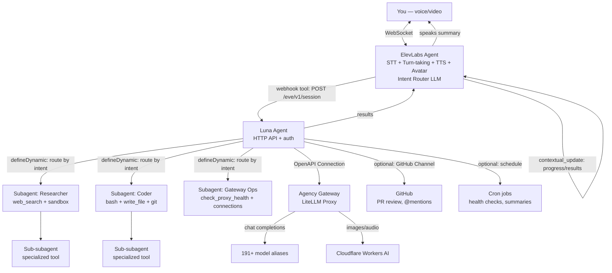

# Historical always-on draft

> Early design exploration retained for decision history. It predates the current
> gateway routing, host-native tools, search adapters, and messaging work. It is
> not an operating guide.

TTS / avatar / intent router LLM / subagent / subagent / subagent / output router LLM / images / tool results / channels / channels / subsubagent / subsubagent

Let me now synthesize everything into a grounded response. Here are my thoughts on each of your points:

---

## Your diagram makes sense

From the SVG text extraction, your diagram shows:

```
[You — voice/video input]
        ↓
[ElevenLabs Agent — TTS + Avatar + Intent Router LLM]
        ↓ routes to          ↓ also speaks updates
[Subagent]  [Subagent]  [Subagent]
   ↓            ↓            ↓
[output router LLM — images, tool results, channels]
        ↓
[channels → back to you]
```

Plus subsubagents branching off the subagents. This is a **hub-and-spoke with a conversational shell** pattern. It's not far off from industry standard at all. Here's how it maps:

## 1. Model catalogue and the "unclean proxy call" problem

This is actually the most important thing to fix first. Here's the real issue I found in the research:

**Your gateway tool files (`generate_image.ts`, `text_to_speech.ts`, `transcribe_audio.ts`, `check_proxy_health.ts`) are hand-rolled `fetch()` calls with duplicated auth.** Each tool independently reads `AGENCY_GATEWAY_BASE_URL` and `AGENCY_GATEWAY_API_KEY` from `process.env`. There's no single source of truth for gateway config. If the URL changes, you edit 4 files. The model can't discover these tools via `connection_search` — it only knows them from their hardcoded descriptions.

**The fix is connections, not tools.** The framework has `defineOpenAPIConnection` built for exactly this: wire an HTTP API with auth, get auto-generated tools per operation, broker auth through the connection layer, let the model discover tools via `connection_search`. One file replaces four, auth is centralized, schemas come from the OpenAPI spec (or you define them inline).

On model catalogue normalisation: your LiteLLM aliases (`glm-5-2`, `z-ai-glm-5.2`, `claude-sonnet-5`, etc.) won't match the Vercel AI Gateway catalog (`anthropic/claude-sonnet-5`, etc.). But `defineDynamic` lets you resolve the model at runtime. You could maintain a small mapping from your alias naming to gateway catalog IDs, or just return `LanguageModel` instances with explicit `modelContextWindowTokens` per model. The framework doesn't consume LiteLLM's `/v1/models` endpoint — so your catalogue would need to be a config file or a `defineDynamic` resolver that fetches from the gateway at startup and caches.

## 2. ElevenLabs as the always-on voice agent

This is where it gets interesting. From the research:

**ElevenLabs Agents (formerly Conversational AI) supports exactly what your diagram describes:**

- WebSocket real-time streaming (`wss://api.elevenlabs.io/v1/convai/conversation`)
- **`contextual_update` events** — you can push non-interrupting context into an active conversation ("the subagent finished, here's what it found") without breaking the dialogue
- **Client tools** — run on your client app, can call your eve backend
- **Webhook tools** — ElevenLabs calls your eve API directly
- **MCP tools** — ElevenLabs can connect to an MCP server (your gateway could expose one)
- **Custom LLM** — you can point ElevenLabs at your own LLM endpoint (your LiteLLM proxy)
- Turn-taking model with configurable patience/eagerness
- Soft timeout filler messages ("hmm, let me think...") while tools run

**The architecture your diagram describes would work like this:**

```
You speak → ElevenLabs Agent (STT + turn-taking + TTS + avatar)
    ↓ intent router LLM classifies the request
    ↓ routes to:
        ├─ eve agent (HTTP POST /eve/v1/session) for complex work
        ├─ direct API call for simple operations
        └─ just talk for conversational responses
    ↓ while eve works:
        ElevenLabs receives contextual_update with progress
        → speaks "I've got a researcher looking into that..."
    ↓ eve subagent completes → result pushed back
        ElevenLabs receives contextual_update with results
        → speaks the summary on its next turn (not blurting)
```

The KEY insight: **ElevenLabs IS the conversational shell. Luna is the worker backend.** The ElevenLabs agent doesn't need to be the eve agent — it calls the eve agent as a tool (webhook tool or client tool that HTTP POSTs to your eve endpoint). Your eve agent becomes the "brain" that routes to subagents, runs tools, executes in sandboxes, and returns structured results.

This matches the industry pattern. OpenAI's Realtime API supports `function` tools where the client executes the logic and returns results. Google's Gemini Live supports `functionCall`/`functionResponse` over WebSocket. ElevenLabs does the same thing. The real-time model handles conversation + turn-taking + audio, and delegates the "thinking" work to external tools. Your eve agent IS that external tool.

## 3. Deployment — what are the options?

**Vercel is the only first-class deployment target for eve.** The framework is built on:

- Vercel Workflow (durable execution, session state)
- Vercel Sandbox (microVM for sandbox)
- Vercel Cron (schedules)

**But "always-on" doesn't mean "always running."** Luna is event-driven. A turn runs when a message arrives, then parks. No compute held while waiting. Sessions can persist for 7 days (your current config) with zero idle compute cost. The workflow durably parks between turns.

**Your other credits:**

- **Cloudflare ($20k)**: No native eve support. The Nitro layer isn't designed for Workers. You'd need custom adapters for Workflow state store + Sandbox — significant work. Not recommended for eve.
- **AWS ($800)**: No native adapter. The `docker()` sandbox backend works on EC2, but you'd need custom Workflow state store + Cron adapters. Also significant work.
- **Vercel free tier**: `eve dev` runs locally for free. Vercel deployment needs their platform — but as an open source project you could apply for Vercel credits.

**My recommendation**: Run `eve dev` locally for development. Deploy to Vercel when you need always-on production. The ElevenLabs agent (which is always-on via their WebSocket) calls your eve endpoint — so the eve agent only needs to be awake when it receives a request, which is exactly the Vercel event-driven model.

## 4. Skills — can eve edit its own source code?

**The sandbox can't access the `agent` directory** — that's app-runtime code, isolated from the sandbox by the security model. But the sandbox CAN have a git clone of the repo checked out into `/workspace`, and the model can run `bash` + `write_file` + `git commit` + `git push` against it. The GitHub channel does exactly this — it checks out the PR ref into the sandbox.

For your `.agents/skills/` question: those are **VS Code Copilot skills** (for your coding assistant). `agent/skills/` is where the **eve agent's** runtime skills live. They use the same SKILL.md convention but serve different consumers. You could symlink the same content to both if you want skills available to both Copilot and the agent. The framework docs explicitly say a skill authored against the Agent Skills standard "ports over as-is."

## 5. README — yes, will do once we decide on architecture

## 6. Sandbox — real binaries in development

`just-bash` can't run `node`, `git`, `python`, or any real binary — it's a pure-JS interpreter. For real binaries you need Docker (locally) or microsandbox (macOS Apple Silicon / Linux KVM).

For development, you can:

1. Start with `just-bash` (zero burden, gives the model `read_file`/`write_file`/`glob`/`grep` but no real shell)
2. Upgrade to `docker()` when you need real binaries (install Docker Desktop on Windows)
3. The Docker backend auto-selects if Docker is available

The built-in `bash`/`read_file`/`write_file`/`glob`/`grep` tools always target the sandbox. But your **authored tools** (like `check_proxy_health`) run in the app runtime with full `process.env` and host access. So you can write custom tools that do anything on the host — they just won't go through the sandbox isolation layer.

## 7. Channels — how generation routing works

"Going through the model" means: the model receives a text request from the user, decides to call `generate_image`, the tool executes, the result (base64 image) comes back to the model as a tool result, and then the model describes it in text. The image data is in the model's context, but the model can't actually _see_ it — it just sees the base64 string.

"Routing to a frontend" means: the tool result goes through a channel as a structured event that the frontend renders directly (e.g., an `` tag in a chat UI). The model never holds the image data — it just knows the tool was called and the frontend handles the display. This is what `useEveAgent` (React) enables — rich content rendering on the client.

With ElevenLabs as the shell: the `client_tool_result` event carries structured data back to the conversation. The ElevenLabs agent speaks about the result, and your frontend (if you have one alongside the voice) renders the image directly.

## 8. GitHub — channel OR connection (both exist)

- **GitHub channel** (`agent/channels/github.ts`): lets the agent be _triggered from_ GitHub — `@mention` in PRs/issues, webhook-driven, checks out the PR ref into the sandbox, auto-replies as a comment
- **GitHub connection** (`agent/connections/github.ts`): lets the agent _call_ the GitHub API — create issues, read PRs, manage labels — as model-callable tools

You'd use both: channel to let the agent respond to PRs, connection to let it open issues or read repo data.

## 9. The "unclean proxy call" — the real diagnosis

From the research, the core issue is architectural:

1. **4 custom tools with duplicated auth** instead of 1 OpenAPI connection
2. **No `agent/connections/` directory exists** — the framework's idiomatic integration surface is unused
3. **LiteLLM proxy's schema sanitizer** (`agency_tool_schema_hooks.py`) strips `additionalProperties`, `format`, `default`, `minimum`, `maximum` from tool schemas in transit — this can break tool calls if the upstream model expects strict schemas (especially Gemini)
4. The model is hardcoded to `glm-5-2` with no dynamic selection

The proper fix:

- Replace the 4 gateway tools with 1 `defineOpenAPIConnection` (or `defineMcpClientConnection` if you stand up an MCP endpoint on the gateway)
- Use `defineDynamic` for model selection
- Keep `whoami` as a custom tool (it's about auth, not gateway)

---

## Putting it all together — the architecture your diagram implies



The flow:

1. You speak to ElevenLabs → STT + intent routing
2. If it needs work → ElevenLabs calls eve via webhook tool (HTTP POST)
3. Luna routes to subagents based on the intent
4. Subagents execute (tools, sandbox, connections, nested subagents)
5. Results flow back to eve → back to ElevenLabs
6. ElevenLabs receives `contextual_update` with results → speaks summary on next turn
7. Your frontend (if present) renders rich output (images, code, diffs) directly

**The eve agent is never interrupted** — it's a worker. The ElevenLabs agent is the conversational surface. The "intent layer" is the ElevenLabs agent's LLM classifying whether the request needs the eve backend or can be answered directly.

---

Thoughts? Should I start on the concrete work — the proper README, the connection-based gateway wiring, the `defineDynamic` model config — or do you want to dial in the architecture more first?
